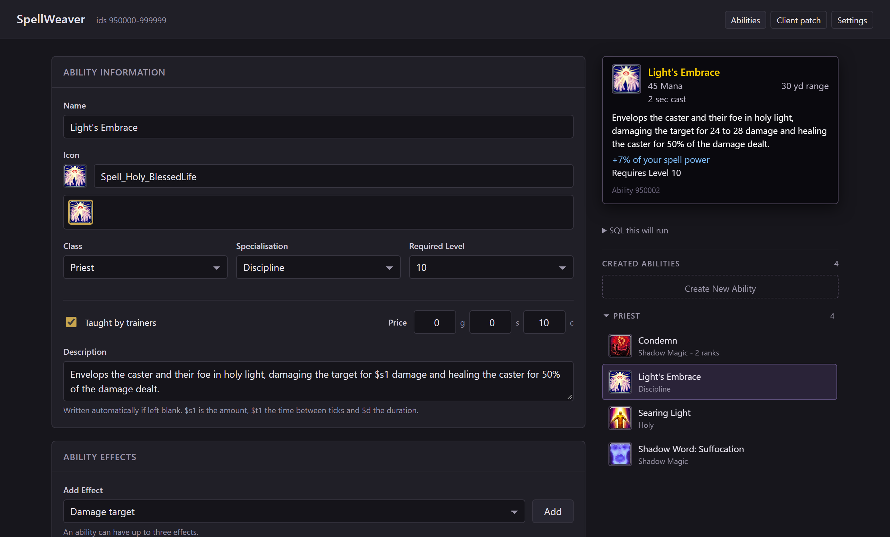

# SpellWeaver

A browser tool for making custom abilities on an AzerothCore 3.3.5a server,
for people who do not know the database schema, Python, or C++.



## What you need

* An AzerothCore 3.3.5a server and its MySQL database.
* A 3.3.5a game client.
* Python 3. https://www.python.org/downloads/

## Getting started

On Windows, double-click **SpellWeaver.bat**. Anywhere else, `python3 run.py`.
The page opens by itself at <http://127.0.0.1:8800/>.

It starts on **Settings** and needs two things:

1. **Your database.** Host, port, user, password, and your world and characters
   database names. **Test Connection** says plainly whether it worked. Saved
   once, remembered after that. If an AzerothCore `.env` is lying around it
   fills the form in for you, as a starting point rather than a requirement.
2. **Your game client.** The folder holding `Wow.exe`. Saving it also copies
   out the eight data files the tool reads, which takes a few seconds.

Then make something:

3. **Abilities.** Name it, pick an icon, pick a class, add effects, set the
   numbers. The tooltip on the right is what the game will show. **Save**.
4. **Client patch > Apply Patch.** Close the game first; a running client holds
   the file open.
5. **Restart the worldserver.** Put your usual restart command in Settings and
   the Client patch page will do it for you.

Then log in and visit the class trainer, or `.learn <id>`.

## How it works

An ability is **two halves**:

* **The server half** is rows in your world database. The tool writes them, and
  the worldserver reads them **when it starts**.
* **The client half** is names, icons and tooltip text, which live in the
  client. The tool builds an MPQ patch and writes it into the client `Data` folder.

Miss the patch and the ability still works, but has no name, no icon and
nothing readable in the combat log. Miss the restart and the server does not
know it exists. Both pages tell you when they are out of date.

Every player who wants to see your abilities needs the patch file.

## What it can do

* **Effects.** "Damage over time", "Heal", "Stun", "Drain
  health". Around 130 of them, derived from what the game's own spells do, so
  the combinations offered are ones that are known to work. Up to three per
  ability, each aimed independently, for example: an ability can damage a target and heal
  the caster at the same time.
* **Ranks.** Build Rank 1 through Rank N as one ability, with their own levels,
  costs and numbers. The tool chains them the way the game does, so a trainer
  offers the next rank and the spellbook shows one entry.
* **Scaling.** A percentage of your spell power or attack power, using the same
  columns the game uses.
* **Variation.** A damage spread, so hits are a range rather than a flat number.
* **Trainers.** Optionally have the ability appear in the relevant class trainers across the game.
* **Icons and animations from your client.** 3,000+ icons and 700+ animations from the game files.
* **The SQL dump.** Every save shows exactly what it will run.

## The reserved band

New abilities are written into ids **950000 to 999999**.

A clean 3.3.5a client stops at id 80,864, so nothing Blizzard shipped can
collide. **Modules might** so your mileage may vary.

**Client patch** reports anything sitting
in the band that SpellWeaver did not put there. If it lists something, change
the band in `spellweaver.json` before you create your first ability:

```json
{ "band": { "start": 1200000, "end": 1249999 } }
```

It refuses to write outside the band, and picks the next free id
every time.

## Settings

| | |
| --- | --- |
| Database | Where abilities are written. Tested before it is saved. |
| Game client | Where the patch is built from, and written to. |
| Worldserver | Your restart command, so the tool can run it. |
| Shut down | Stops the server. Closing its window does the same. |

Your details are kept in `data/`, which is local to your machine and is not
committed.

## Troubleshooting

* **The ability has no name in game.** The client patch is missing or stale.
  Apply it again and restart the client.
* **The server does not know the ability exists.** Restart the worldserver.
* **The patch will not write.** The game is running and holding the file open.
* **The page says SpellWeaver is not running.** Its window was closed. Start it
  again.
* **`.cast` says the spell is not ready.** It has a cooldown and you already
  cast it. Wait, or use `.aura` to test the effect on its own.
* **The ability cannot be purchased at a trainer.** The 'Purchasable from trainers'
  option was not selected when the ability was created. Select that option and
  restart the worldserver.

## Notes

The reasoning behind the awkward parts, from MPQ writing to client load order
to why a rank chain has to be contiguous, is in the code comments next to the
code it explains, where it stays true.

`tools/selfcheck.py` checks the tool against your client's data and needs no
server. `tools/acceptance.py` runs against a live install, writes real
abilities, and removes them afterwards.

## Trainers

An ability can be taught, at a price, decided while you build it. If you choose
not to have your ability sold by trainers, you will need to use `.learn <id>`.
